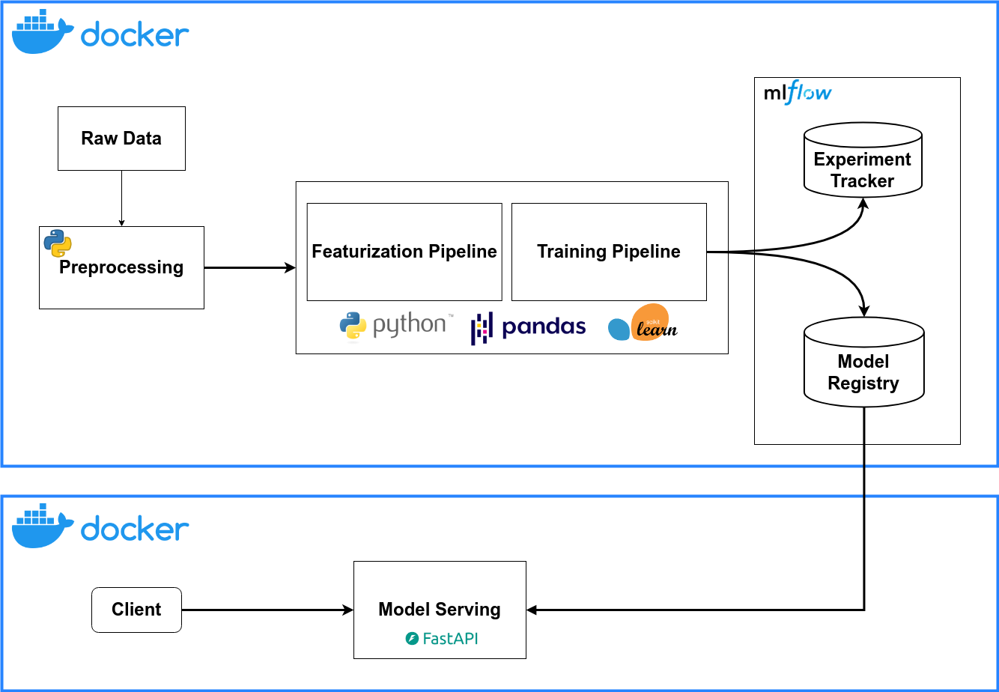

# Fraud Detection Case Study

This project implements a fraud detection system using MLflow for model tracking and management, along with separate services for model training and serving.

## Project Structure

The project consists of three main services:

1. MLflow Server
2. Fraud Detection Trainer
3. Fraud Detection Server

## Project Architecture

The overall architecture of the project is illustrated in the following diagram:



## Prerequisites

- Docker
- Docker Compose
- uv package manager
```
pip install uv
```

## Data

Portion of the Credit Card Transactions Fraud Detection Dataset. It consists of a simulated credit card transaction dataset containing legitimate and fraud transactions from the duration 1st Jan 2019 - 31st Dec 2020. 

## Services

### MLflow Server

- Runs on port 5000
- Uses SQLite as the backend store
- Serves artifacts locally

### Fraud Detection Trainer

This is the Python package that:

- Builds and trains the fraud detection model
- Uses MLflow for experiment tracking
- Stores trained model packages in a shared volume

Key features:
- Utilizes scikit-learn for machine learning pipelines
- Implements custom feature engineering
- Integrates with MLflow for experiment tracking and model versioning

For more details, see the trainer's [README](fraud-detection-trainer/README.md)


### Fraud Detection Server

This is the FastAPI-based web application that:

- Serves the trained fraud detection model
- Runs on port 8000
- Depends on the successful completion of the training service

Key features:
- FastAPI for high-performance API development
- MLflow integration for model management
- Real-time fraud prediction capabilities

For more details, see the servers's [README](fraud-detection-server/README.md)

## Setup and Running

1. Make sure the infrastructure prerequisites are installed (Docker, Docker-Compose and uv), uv can be installed through:
   ```
   pip install uv
   ```

1. Clone the repository:
   ```
   git clone <repository-url>
   cd fraud-detection-case-study
   ```

2. Start the services:
   ```
   docker compose up --build
   ```

3. Access the services:
   - MLflow UI: http://localhost:5000
   - Fraud Detection API: http://localhost:8000/docs

## Configuration

- MLflow configuration is defined in the `mlflow.Dockerfile`
- Training configuration is located in `./fraud-detection-trainer/config/training.yaml`
- Server configuration is defined in the `./fraud-detection-server/Dockerfile`

## Development

To make changes to the project:

1. Modify the relevant service code
2. Rebuild and restart the services:
   ```
   docker compose up --build
   ```

## Notes

- The trainer service builds a wheel package and stores it in a shared volume
- The server service depends on the successful completion of the training process
- To update the documentation files, execute the following command inside each module:
   ```
   uv run pdoc -d markdown -o docs/ src/
   ```

For more detailed information about each service, refer to their respective directories and Dockerfiles.

## License

This project is licensed under the MIT License. See the LICENSE file in each module for details.
